# Polyglot Codebase Knowledge Graph

> Generated offline by **readmenator**. Supports C, C++, Python, Go, Rust, JS/TS, Java, C#, Shell, PHP, Dart, GDScript, Nim, ASM.
> No LLMs. No tokens. Pure static analysis. See more [here](https://github.com/grisuno/ReadMenator)

**Total Files Parsed:** 2 | **Total Symbols Extracted:** 9 | **Total Imports:** 7

## Structural Knowledge Map

```mermaid
graph TD
    classDef mod fill:#1e1e1e,stroke:#ff6666,stroke-width:2px,color:#fff;
    classDef cls fill:#2d2d2d,stroke:#4ec9b0,stroke-width:2px,color:#fff;
    classDef fn fill:#333,stroke:#dcdcaa,stroke-width:1px,color:#dcdcaa;
    classDef ext fill:#111,stroke:#666,stroke-dasharray:5 5,color:#aaa;
    app_py["app.py (py)"]
    class app_py mod;
    app_py_generate_wave_data["generate_wave_data"]
    class app_py_generate_wave_data fn;
    app_py --> app_py_generate_wave_data
    app_py_WaveGrokCNN["WaveGrokCNN"]
    class app_py_WaveGrokCNN cls;
    app_py --> app_py_WaveGrokCNN
    app_py_expand_model_weights_physics["expand_model_weights_physics"]
    class app_py_expand_model_weights_physics fn;
    app_py --> app_py_expand_model_weights_physics
    app_py_evaluate_expanded_physics["evaluate_expanded_physics"]
    class app_py_evaluate_expanded_physics fn;
    app_py --> app_py_evaluate_expanded_physics
    app_py_train_until_grokking["train_until_grokking"]
    class app_py_train_until_grokking fn;
    app_py --> app_py_train_until_grokking
    install_sh["install.sh (sh)"]
    class install_sh mod;
    ext_torch["torch"]
    class ext_torch ext;
    app_py -.->|imports| ext_torch
    ext_torch_nn["torch.nn"]
    class ext_torch_nn ext;
    app_py -.->|imports| ext_torch_nn
    ext_torch_nn_functional["torch.nn.functional"]
    class ext_torch_nn_functional ext;
    app_py -.->|imports| ext_torch_nn_functional
    ext_numpy["numpy"]
    class ext_numpy ext;
    app_py -.->|imports| ext_numpy
    ext_math["math"]
    class ext_math ext;
    app_py -.->|imports| ext_math
    ext_os["os"]
    class ext_os ext;
    app_py -.->|imports| ext_os
    ext_copy["copy"]
    class ext_copy ext;
    app_py -.->|imports| ext_copy
```

---

## Architecture Reference

### PY (1 files)

#### `app.py`
**Path:** `app.py`

**Classes:**
- `WaveGrokCNN` (line 112) `class WaveGrokCNN` - *Physics-aware CNN architecture that respects the local stencil structure
of the wave equation. This architecture can be scaled to arbitrary grid sizes
while preserving the learned physical law.*

**Functions:**
- `generate_wave_data` (line 43) `def generate_wave_data(N, T, c, dt, L, seed)` - *Generate synthetic dataset for 1D wave equation using exact numerical scheme.

Parameters:
    N: Number of spatial points
    T: Number of time steps
    c: Wave speed
    dt: Time step
    L: Domain length (x ∈ [0, L])

Returns:
    X: [T, 2, N] - Wave states at t and t-Δt
    Y: [T, N]   - Wave state at t+Δt*
- `expand_model_weights_physics` (line 161) `def expand_model_weights_physics(model, target_N, base_N)` - *Physics-aware weight expansion that preserves the discrete Laplacian structure.

Instead of naively expanding all dimensions, this approach:
1. Keeps convolutional kernels the same size (preserving local stencil)
2. Only expands the spatial dimension by adjusting padding
3. Maintains the same physical parameters (c, dt, dx scaling)

This is crucial for PDEs where the algorithm is local and scale-invariant.*
- `evaluate_expanded_physics` (line 224) `def evaluate_expanded_physics(model, base_N, target_N, device, seed)` - *Evaluate expanded model with proper physics scaling.

Key insight: When expanding grid size, we must maintain the same PHYSICAL domain size
and adjust dx accordingly to preserve the CFL condition.*
- `train_until_grokking` (line 258) `def train_until_grokking(model, X, Y, device, grok_threshold, max_steps)`
- `main` (line 307) `def main()`
- `step` (line 67) `def step(u_t, u_tm1)` - *One-step wave propagation using finite difference.*
- `__init__` (line 118) `def __init__(self, hidden_dim)`
- `forward` (line 150) `def forward(self, x)`

### SH (1 files)

#### `install.sh`
**Path:** `install.sh`

*No symbols extracted*
