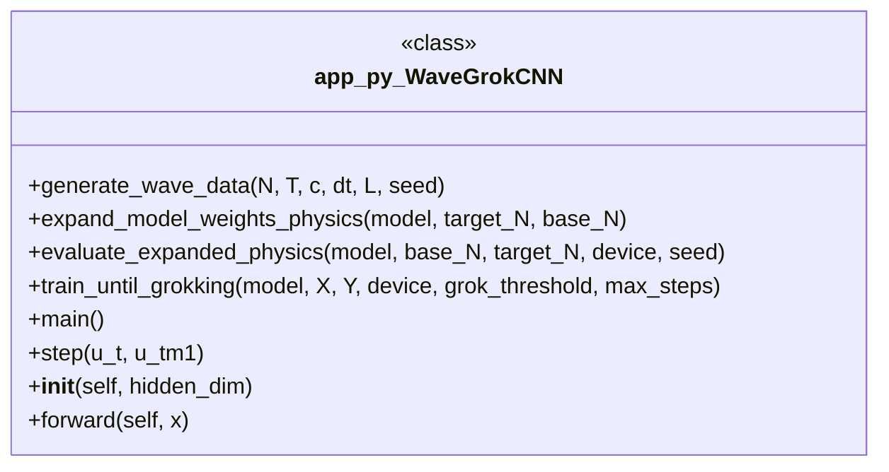

# Polyglot Codebase Knowledge Graph

> Generated offline by **readmenator**. 2 files, 9 symbols, 7 imports. Supports C, C++, Python, Go, Rust, JS/TS, Java, C#, Shell, PHP, Dart, GDScript, Nim, ASM, Ruby, Swift, Kotlin, Scala, Lua, Elixir.
> No LLMs. No tokens. Pure static analysis. See more [here](https://github.com/grisuno/ReadMenator)

**Start here:** Statistics Dashboard for scope, God Nodes for blast radius, Architecture Reference for per-file API. Agents: prefer `readmenator-agent/INDEX.md` + `SYMBOLS.md`.

**Wiki:** prefer `readmenator-wiki/index.md` for progressive disclosure: one synthesis page per community, `connections.json` with EXTRACTED vs INFERRED confidence, `queries.md` log, `REPORT.md` audit.

**Confidence:** EXTRACTED = parsed from source, INFERRED = heuristic bridge, AMBIGUOUS = reported, never hidden. See `readmenator-wiki/REPORT.md`.

**Total Files Parsed:** 2 | **Total Symbols Extracted:** 9 | **Total Imports:** 7

<!-- ranking_model: v1.0 | weights: {ppr:0.45,auth:0.2,test:0.15,doc:0.1,fresh:0.1} | alpha:0.85 | commit:b3ca3bb | date:2026-07-18 -->


## Table of Contents

1. [Statistics Dashboard](#statistics-dashboard)
2. [Architectural Layers](#architectural-layers)
3. [Ranked Context](#ranked-context)
4. [God Nodes](#god-nodes)
5. [Suggested Questions](#suggested-questions)
6. [Hotspot Analysis](#hotspot-analysis)
7. [Change Impact Analysis](#change-impact-analysis)
8. [Suggested Linting Rules](#suggested-linting-rules)
9. [Orphans](#orphans)
10. [Query Recipes](#query-recipes)
11. [Structural Knowledge Map](#structural-knowledge-map)
12. [UML Class Diagram](#uml-class-diagram)
13. [Code Property Graph](#code-property-graph)
14. [Architecture Reference](#architecture-reference)
    - [PY (1 files)](#py-1-files)
    - [SH (1 files)](#sh-1-files)

---

## Statistics Dashboard

| Metric | Value |
|--------|-------|
| Total Files | 2 |
| Total Symbols | 9 |
| Total Imports | 7 |
| Call Edges | 123 |
| Inheritance Edges | 1 |
| Languages | 2 |
| Avg Symbols/File | 4.5 |
| Avg Imports/File | 3.5 |

### Top Files by Import Count (Fan-Out)

| File | Imports | Symbols | Language |
|------|---------|---------|----------|
| `app.py` | 7 | 9 | py |

---

## Architectural Layers

Auto-detected from path patterns, naming conventions, and imported frameworks.

| Layer | Files |
|-------|-------|
| utility | 2 |

### utility

- `app.py` (py, 9 symbols)
- `install.sh` (sh, 0 symbols)

---

## Ranked Context

Files ranked by composite score for the current query context. The ranking combines Personalized PageRank (query relevance), global authority, test coverage, documentation coverage, and code freshness. Model: v1.0.

| Rank | File | Composite | PPR | Authority | Test | Doc |
|------|------|-----------|-----|-----------|------|-----|
| 1 | `app.py` | 0.0667 | 0.0000 | 0.0000 | 0.00 | 0.67 |
| 2 | `install.sh` | 0.0000 | 0.0000 | 0.0000 | 0.00 | 0.00 |

---

## God Nodes

Most architecturally central files ranked by combined import/export degree and symbol richness.

| File | Score | Connections | PageRank |
|------|-------|-------------|----------|
| `app.py` | 0.9 | | 0.0000 |
| `install.sh` | 0.0 | | 0.0000 |

---

## Suggested Questions

Auto-generated exploration prompts based on graph structure:

- What does app.py depend on, and what depends on it? (0 connections)
- What does install.sh depend on, and what depends on it? (0 connections)
- What is WaveGrokCNN in app.py and how is it used?
- What is the overall architecture of this codebase?

---

## Hotspot Analysis

Files ranked by combined complexity (symbol count) and centrality (connection count). High-scoring files are architecturally critical and may need refactoring attention.

| File | Complexity | Centrality | Combined | Symbols | Connections |
|------|-----------|------------|----------|---------|-------------|
| `app.py` | 1.000 | 1.000 | 1.000 | 9 | 7 |
| `install.sh` | 0.000 | 0.000 | 0.000 | 0 | 0 |

---

## Change Impact Analysis

Files sorted by how many other files would be affected if they changed. High-impact files should be changed with caution.

| File | Direct Dependents | Transitive Dependents | Total Impact |
|------|------------------|----------------------|--------------|
| `app.py` | 0 | 0 | 0 |
| `install.sh` | 0 | 0 | 0 |

---

## Suggested Linting Rules

Automatically suggested linting and security rules based on patterns detected in the codebase. These can be exported as Semgrep rules using the `--export-rules` flag.

| Rule ID | Severity | Description | Language | Matches |
|---------|----------|-------------|----------|---------|
| `RM001` | info | Large number of functions in py: 8 total | py | 8 |
| `RM002` | info | Print statement found (consider logging instead) | python | 24 |

---

## Orphans

Files with no documentation or low connectivity. These are candidates for documentation investment or cleanup.

- `install.sh` (0 symbols, no doc)

---

## Query Recipes

Example queries you can run against this knowledge base using the ranking engine:

```
# Find files most relevant to a concept
readmenator query "Where is the import resolver implemented?"

# Rank files by relevance to a topic
readmenator query "How does documentation generation work?"

# Explain why a file ranks highly
readmenator query "explain readmenator/_documentation.py"

# Trace dependency paths with ranked context
readmenator query "path from CLI to exporter"
```

The ranking model uses the following signals:

- **Personalized PageRank** (45% weight): query-specific relevance via seed propagation
- **Global Authority** (20% weight): structural importance via standard PageRank
- **Test Coverage** (15% weight): fraction of symbols referenced in test files
- **Doc Coverage** (10% weight): presence of docstrings and file-level docs
- **Freshness** (10% weight): recent modification activity

Results include score decomposition and justification paths for each ranked item.

---

## Structural Knowledge Map

```mermaid
graph TD
    classDef mod fill:#1e1e1e,stroke:#ff6666,stroke-width:2px,color:#fff;
    classDef cls fill:#2d2d2d,stroke:#4ec9b0,stroke-width:2px,color:#fff;
    classDef fn fill:#333,stroke:#dcdcaa,stroke-width:1px,color:#dcdcaa;
    classDef ext fill:#111,stroke:#666,stroke-dasharray:5 5,color:#aaa;
    app_py["app.py (py)"]
    class app_py mod;
    app_py_generate_wave_data["generate_wave_data"]
    class app_py_generate_wave_data fn;
    app_py --> app_py_generate_wave_data
    app_py_WaveGrokCNN["WaveGrokCNN"]
    class app_py_WaveGrokCNN cls;
    app_py --> app_py_WaveGrokCNN
    app_py_expand_model_weights_physics["expand_model_weights_physics"]
    class app_py_expand_model_weights_physics fn;
    app_py --> app_py_expand_model_weights_physics
    app_py_evaluate_expanded_physics["evaluate_expanded_physics"]
    class app_py_evaluate_expanded_physics fn;
    app_py --> app_py_evaluate_expanded_physics
    app_py_train_until_grokking["train_until_grokking"]
    class app_py_train_until_grokking fn;
    app_py --> app_py_train_until_grokking
    install_sh["install.sh (sh)"]
    class install_sh mod;
    ext_torch["torch"]
    class ext_torch ext;
    app_py -.->|imports| ext_torch
    ext_torch_nn["torch.nn"]
    class ext_torch_nn ext;
    app_py -.->|imports| ext_torch_nn
    ext_torch_nn_functional["torch.nn.functional"]
    class ext_torch_nn_functional ext;
    app_py -.->|imports| ext_torch_nn_functional
    ext_numpy["numpy"]
    class ext_numpy ext;
    app_py -.->|imports| ext_numpy
    ext_math["math"]
    class ext_math ext;
    app_py -.->|imports| ext_math
    ext_os["os"]
    class ext_os ext;
    app_py -.->|imports| ext_os
    ext_copy["copy"]
    class ext_copy ext;
    app_py -.->|imports| ext_copy
```



---

## UML Class Diagram

Auto-generated Mermaid class diagram from parsed class-level symbols. Shows classes, structs, interfaces, traits, and their methods with inheritance and dependency relationships.



---

## Code Property Graph

Machine-readable Code Property Graph (CPG) in JSON-LD format. This block allows AI agents to parse the full structural graph without additional file reads. Compatible with GraphRAG pipelines.

```json
{"@context": "https://schema.org", "analysis": {"communities": [], "god_nodes": [{"node_id": "app.py", "score": 0.9}, {"node_id": "install.sh", "score": 0.0}], "surprising_connections": []}, "edges": [{"confidence": "EXTRACTED", "relation": "imports", "source": "app.py", "target": "torch"}, {"confidence": "EXTRACTED", "relation": "imports", "source": "app.py", "target": "torch.nn"}, {"confidence": "EXTRACTED", "relation": "imports", "source": "app.py", "target": "torch.nn.functional"}, {"confidence": "EXTRACTED", "relation": "imports", "source": "app.py", "target": "numpy"}, {"confidence": "EXTRACTED", "relation": "imports", "source": "app.py", "target": "math"}, {"confidence": "EXTRACTED", "relation": "imports", "source": "app.py", "target": "os"}, {"confidence": "EXTRACTED", "relation": "imports", "source": "app.py", "target": "copy"}], "generator": "readmenator", "metadata": {"edge_count": 131, "file_count": 2, "language_count": 2, "symbol_count": 9}, "nodes": [{"doc": "app.py  Autor: Gris Iscomeback Correo electrónico: grisiscomeback[at]gmail[dot]com Fecha de creación: xx/xx/xxxx Licencia: GPL v3  Descripción:", "id": "app.py", "kind": "module", "label": "app.py", "language": "py", "sha256": "f5aacb15743b896a", "symbol_count": 9, "symbols": [{"doc": "Generate synthetic dataset for 1D wave equation using exact numerical scheme.\n\nParameters:\n    N: Number of spatial points\n    T: Number of time steps\n    c: Wave speed\n    dt: Time step\n    L: Domain length (x ∈ [0, L])\n\nReturns:\n    X: [T, 2, N] - Wave states at t and t-Δt\n    Y: [T, N]   - Wave state at t+Δt", "kind": "function", "line": 43, "name": "generate_wave_data", "signature": "def generate_wave_data(N, T, c, dt, L, seed)"}, {"doc": "Physics-aware CNN architecture that respects the local stencil structure\nof the wave equation. This architecture can be scaled to arbitrary grid sizes\nwhile preserving the learned physical law.", "kind": "class", "line": 112, "name": "WaveGrokCNN", "signature": "class WaveGrokCNN(Module)"}, {"doc": "Physics-aware weight expansion that preserves the discrete Laplacian structure.\n\nInstead of naively expanding all dimensions, this approach:\n1. Keeps convolutional kernels the same size (preserving local stencil)\n2. Only expands the spatial dimension by adjusting padding\n3. Maintains the same physical parameters (c, dt, dx scaling)\n\nThis is crucial for PDEs where the algorithm is local and scale-invariant.", "kind": "method", "line": 161, "name": "expand_model_weights_physics", "signature": "def expand_model_weights_physics(model, target_N, base_N)"}, {"doc": "Evaluate expanded model with proper physics scaling.\n\nKey insight: When expanding grid size, we must maintain the same PHYSICAL domain size\nand adjust dx accordingly to preserve the CFL condition.", "kind": "method", "line": 224, "name": "evaluate_expanded_physics", "signature": "def evaluate_expanded_physics(model, base_N, target_N, device, seed)"}, {"kind": "method", "line": 258, "name": "train_until_grokking", "signature": "def train_until_grokking(model, X, Y, device, grok_threshold, max_steps)"}, {"kind": "method", "line": 307, "name": "main", "signature": "def main()"}, {"doc": "One-step wave propagation using finite difference.", "kind": "method", "line": 67, "name": "step", "signature": "def step(u_t, u_tm1)"}, {"kind": "method", "line": 118, "name": "__init__", "signature": "def __init__(self, hidden_dim)"}, {"kind": "method", "line": 150, "name": "forward", "signature": "def forward(self, x)"}]}, {"id": "install.sh", "kind": "module", "label": "install.sh", "language": "sh", "sha256": "c907d80fd6734993", "symbol_count": 0, "symbols": []}], "type": "CodePropertyGraph", "version": "1.0"}
```

---

## Architecture Reference

### PY (1 files)

#### `app.py`
**Path:** `app.py`
**File Doc:** *app.py  Autor: Gris Iscomeback Correo electrónico: grisiscomeback[at]gmail[dot]com Fecha de creación: xx/xx/xxxx Licencia: GPL v3  Descripción:*

**Classes:**
- `WaveGrokCNN` (line 112) `class WaveGrokCNN(Module)` - *Physics-aware CNN architecture that respects the local stencil structure
of the wave equation. This architecture can be scaled to arbitrary grid sizes
while preserving the learned physical law.*

**Functions:**
- `generate_wave_data` (line 43) `def generate_wave_data(N, T, c, dt, L, seed)` - *Generate synthetic dataset for 1D wave equation using exact numerical scheme.

Parameters:
    N: Number of spatial points
    T: Number of time steps
    c: Wave speed
    dt: Time step
    L: Domain length (x ∈ [0, L])

Returns:
    X: [T, 2, N] - Wave states at t and t-Δt
    Y: [T, N]   - Wave state at t+Δt*

**Methods:**
- `expand_model_weights_physics` (line 161) `def expand_model_weights_physics(model, target_N, base_N)` - *Physics-aware weight expansion that preserves the discrete Laplacian structure.

Instead of naively expanding all dimensions, this approach:
1. Keeps convolutional kernels the same size (preserving local stencil)
2. Only expands the spatial dimension by adjusting padding
3. Maintains the same physical parameters (c, dt, dx scaling)

This is crucial for PDEs where the algorithm is local and scale-invariant.*
- `evaluate_expanded_physics` (line 224) `def evaluate_expanded_physics(model, base_N, target_N, device, seed)` - *Evaluate expanded model with proper physics scaling.

Key insight: When expanding grid size, we must maintain the same PHYSICAL domain size
and adjust dx accordingly to preserve the CFL condition.*
- `train_until_grokking` (line 258) `def train_until_grokking(model, X, Y, device, grok_threshold, max_steps)`
- `main` (line 307) `def main()`
- `step` (line 67) `def step(u_t, u_tm1)` - *One-step wave propagation using finite difference.*
- `__init__` (line 118) `def __init__(self, hidden_dim)`
- `forward` (line 150) `def forward(self, x)`

### SH (1 files)

#### `install.sh`
**Path:** `install.sh`

*No symbols extracted*
